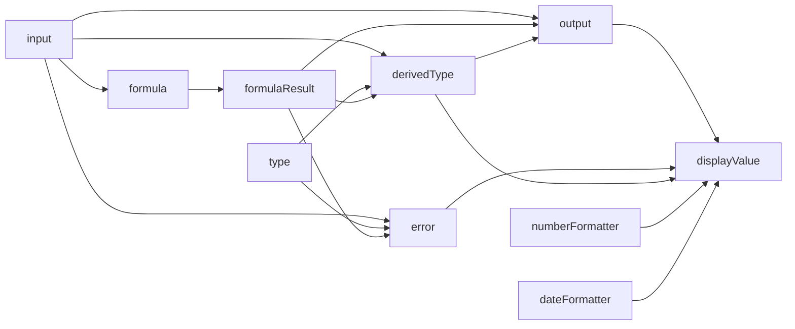
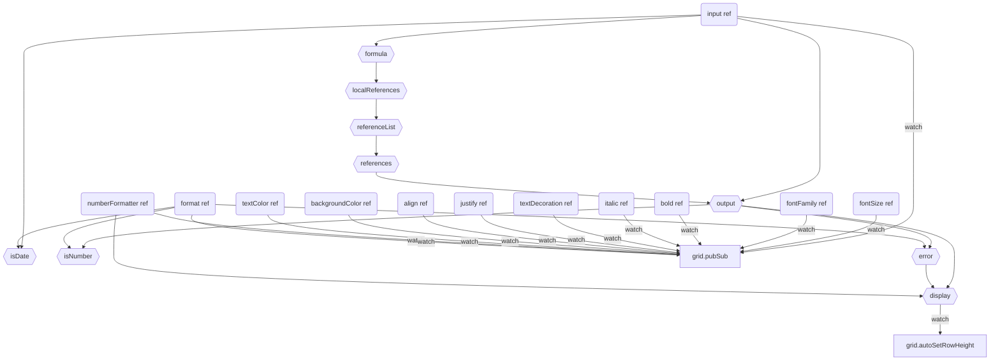

# S-Grid

A Lisp based spread sheet.

```mermaid
flowchart LR
    input --> formula
    formula --> formulaResult
    input & type & formulaResult --> derivedType
    input & type & formulaResult --> error
    input & formulaResult & derivedType --> output
    output & error & derivedType & numberFormatter & dateFormatter --> displayValue
```

```mermaid
graph TD
    %% Reactive refs
    input(input ref)
    format(format ref)
    numberFormatter(numberFormatter ref)
    fontSize(fontSize ref)
    fontFamily(fontFamily ref)
    bold(bold ref)
    italic(italic ref)
    textDecoration(textDecoration ref)
    justify(justify ref)
    align(align ref)
    backgroundColor(backgroundColor ref)
    textColor(textColor ref)

    %% Computed properties
    formula{{formula}}
    localReferences{{localReferences}}
    referenceList{{referenceList}}
    references{{references}}
    output{{output}}
    display{{display}}
    isDate{{isDate}}
    isNumber{{isNumber}}
    error{{error}}

    %% Dependencies
    input --> formula
    input --> output
    input --> isDate
    
    formula --> localReferences
    localReferences --> referenceList
    referenceList --> references
    references --> output
    
    output --> display
    output --> isNumber
    output --> error
    
    format --> isDate
    format --> isNumber
    format --> error
    
    error --> display
    
    numberFormatter --> display
    
    %% Watch dependencies
    display -->|watch| grid[grid.autoSetRowHeight]
    
    input -->|watch| pubSub[grid.pubSub]
    fontSize -->|watch| pubSub
    fontFamily -->|watch| pubSub
    bold -->|watch| pubSub
    italic -->|watch| pubSub
    textDecoration -->|watch| pubSub
    justify -->|watch| pubSub
    align -->|watch| pubSub
    backgroundColor -->|watch| pubSub
    textColor -->|watch| pubSub
    numberFormatter -->|watch| pubSub
    format -->|watch| pubSub
```