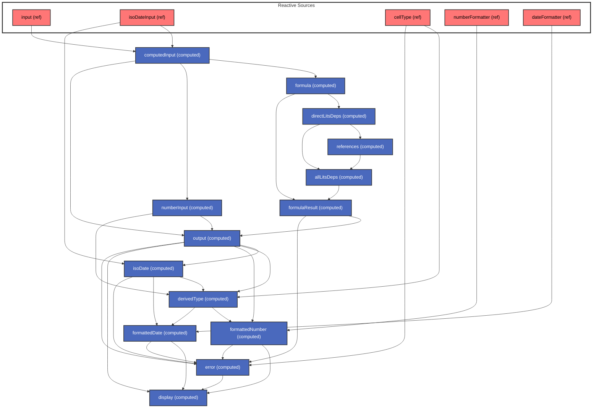

# Cell Class

The `Cell` class represents a single cell within a grid, managing its content, formatting, and reactive relationships.

## Overview

A cell maintains its state through reactive properties (using Vue.js reactivity system) and provides computed values based on formulas, references, and formatting rules.

## Reactive Architecture

