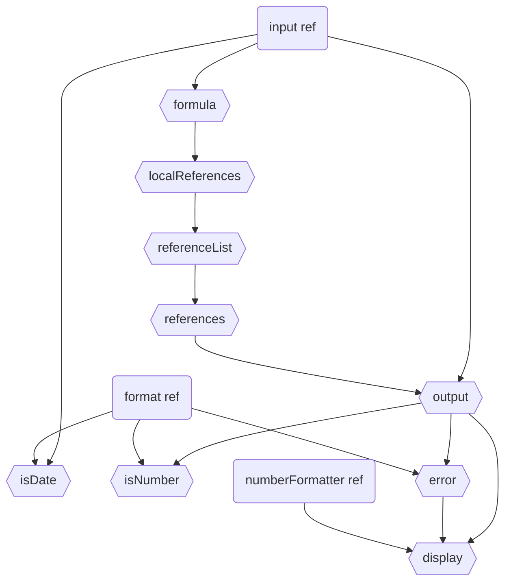

# Cell Class

The `Cell` class represents a single cell within a grid, managing its content, formatting, and reactive relationships.

## Overview

A cell maintains its state through reactive properties (using Vue.js reactivity system) and provides computed values based on formulas, references, and formatting rules.

## Reactive Architecture



## Properties

### Reactive References
- `input`: Raw cell content (string)
- `format`: Cell format type (auto/number/string/date)
- `numberFormatter`: Formatting rules for numbers
- `fontSize`: Cell font size
- `fontFamily`: Cell font family
- `bold`: Bold state
- `italic`: Italic state
- `textDecoration`: Text decoration style
- `justify`: Horizontal alignment
- `align`: Vertical alignment
- `backgroundColor`: Cell background color
- `textColor`: Text color

### Computed Properties
- `formula`: Extracted formula when input starts with '='
- `localReferences`: Direct cell references in the formula
- `referenceList`: Resolved cell references
- `references`: All recursive references
- `output`: Computed cell value after formula evaluation
- `display`: Formatted display value
- `isDate`: Whether the cell contains a date
- `isNumber`: Whether the cell contains a number
- `error`: Any computation or formatting errors

## Usage Examples

### Basic Cell Usage
```typescript
const cell = new Cell(cellRef, { project, grid });

// Setting content
cell.input.value = "42";           // Number
cell.input.value = "=A1 + B1";     // Formula
cell.input.value = "'Hello";       // Text with leading quote
cell.input.value = "Today";        // Special date value

// Formatting
cell.format.value = "number";
cell.numberFormatter.value = "#,##0.00";
cell.fontSize.value = "12px";
```

### Formula Support
The cell supports formulas with references to other cells:
```typescript
// Simple arithmetic
cell.input.value = "=A1 + B1";

// Function with range
cell.input.value = "=SUM(A1:A10)";

// Complex formula with references
cell.input.value = "=IF(A1 > 0, B1 * C1, D1)";
```

### DTO Support
The class provides methods to serialize/deserialize cell state:
```typescript
// Get cell state
const dto = cell.getDTO();

// Update cell state
cell.setDTO({
  input: "42",
  format: "number",
  numberFormatter: "#,##0.00"
});

// Clear cell state
cell.clear();
```

## Events

The cell emits change events through the grid's PubSub system for:
- Input changes
- CellType changes
- Style changes (font, color, alignment)

## Development Notes

1. The cell maintains its own reactivity system but is integrated with the grid
2. Formula evaluation is lazy and cached
3. Reference tracking prevents circular dependencies
4. Display formatting is handled separately from value computation

## Best Practices

1. Always use `setDTO()` for bulk updates to prevent multiple reactions
2. Clear cells using the `clear()` method instead of manually resetting properties
3. Monitor the `error` computed property for validation issues
4. Use `getDebugInfo()` for troubleshooting formula and reference issues

## Related Components

- [Grid](./grid/Grid.md): Container for cells
- `Project`: Manages multiple grids
- `RangeReference`: Handles cell range references
- `CellReference`: Handles individual cell references